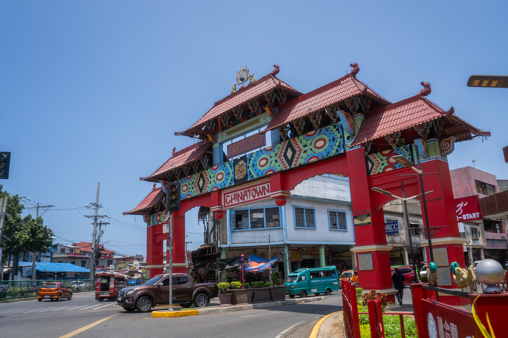
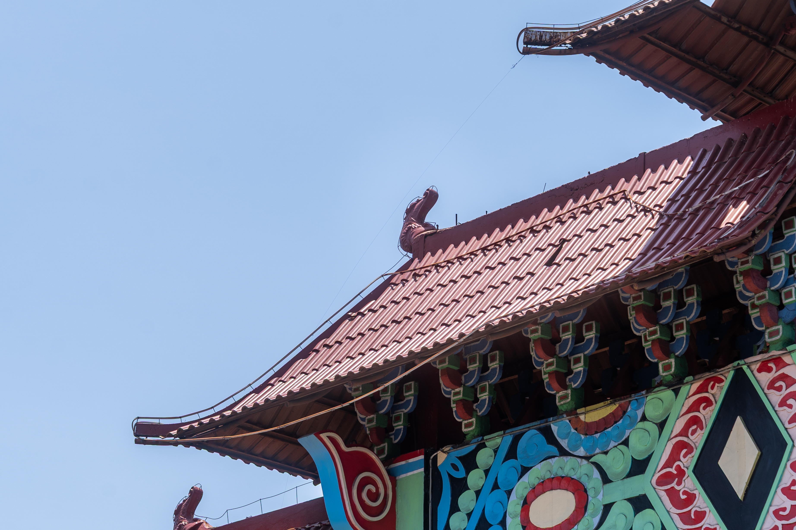
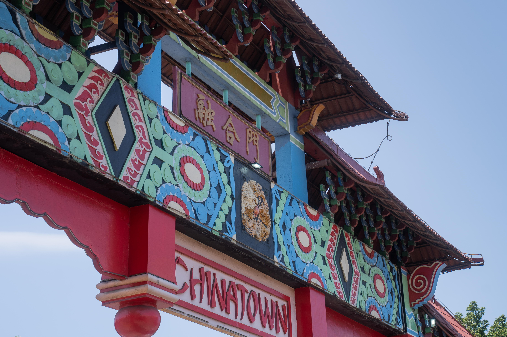
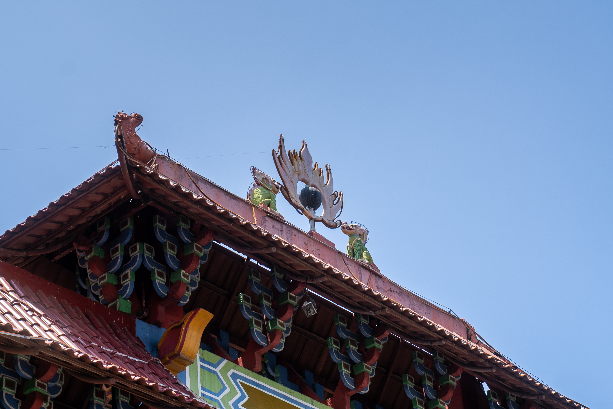
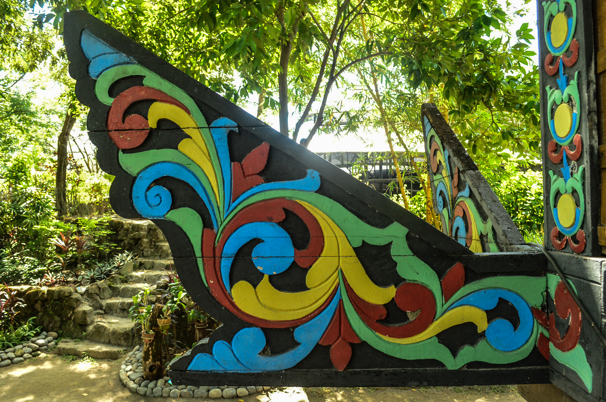

# Reading the Landscape of Davao City Chinatown

As part of its tourism and heritage initiatives, the Davao City government, in cooperation with Davao City Chinatown Development Council (DCCDC), has progressively developed and promoted the district since its designation in 2023. 

This section examines the visual elements introduced through the Davao City Chinatown Development Council's initiatives. The discussion is based primarily on my personal observations while walking through the area and an interview with members of the council. 

## Archways

Davao City's Chinatown has four archways serving as its entry points: the Unity Archway 「融合門」, the Peace Archway 「和平門」 , the Friendship Archway 「友誼門」, and the Prosperity Archway 「繁榮門 . These structures mark the boundaries of the district while also serving as prominent visual symbols of Chinatown. 

 
<iframe 
  style="width: 70%; height: 350px; border: 0;" 
  allowfullscreen 
  allow="geolocation" 
  src="https://umap.openstreetmap.fr/en/map/chinatown_arches_1447266?scaleControl=false&miniMapControl=true&scrollWheelZoom=false&zoomControl=true&editMode=disabled&moreControl=true&searchControl=null&tilelayersControl=null&embedControl=null&datalayersControl=true&onLoadPanel=none&captionBar=false&captionMenus=true#15/7.075159/125.620025">
</iframe>

### Unity Archway 「融合門」and the Unity Park 「融合園」

    

    
    

Completed on January 31, 2009, this was the second of four archways planned in Chinatown. The archway is characterized by its red, blue, green, and gold color scheme. Text visible on the arch are the Chinese characters for unity 「融合」 and 'Chinatown', written in a stylized font. The multi-tiered roof features several Chinese motifs: the carp, the dragon, and the burning pearl. The colorful plant-like pattern that runs across the middle of the arch bear visual similarities to decorative patterns found in Mindanao. Whether intentional or not, the representation of both cultures lives up to the ideals of unity the archway symbolize. 

  
  
  

    The Unity Arch was recently repainted in February 2026 in preparation for the Chinese New Year celebration

    

    

Nikka Cunom, CC BY 2.0 <https://creativecommons.org/licenses/by/2.0>, via Wikimedia Commons

*Panalong, the extended house beam of a torogan, found on houses of sultans of the Maranao*

The construction of the archway was made possible with the donations of members of the Filipino-Chinese community, the Dabaw Kaisa Foundation, Inc., the Davao Filipino Chinese Chamber of Commerce, Inc., Davao Lioc Kui Fraternity, Inc., the Davao Filipino-Chinese Young Entrepreneur's Club, the Davao Filipino-Chinese Amity Club Davao Chapter, the Philippine Lam An Association Mindanao Chapter, and the Philippine Trust Bank.

Right next to the archway is the Unity Park, which was completed in 2020. The park was a later addition, proposed by then-mayor Sara Duterte, who envisioned a wishing tree as its centerpiece. 

Familiar design motifs are present at the park: dragons chasing durians (rather than flaming pealrs), what appears to be stone lanterns, and geometric patterns found on the guardrails and lamp posts. 

    

        
        
        
    

